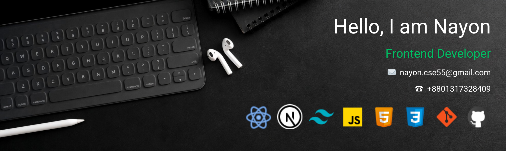

 

## 👨‍💻 About Me

 I am Nayon. I am a MERN Stack Developer. I have hands-on experience with modern web development technologies including <b>Next.js, React.js, Tailwind CSS, JavaScript (ES6+), Express.js, MongoDB, HTML5, CSS3, Git, </b> and <b>GitHub</b>. I’ve completed some projects. These projects helped me understand responsive design, debugging, optimization, error fixing and improving user-experience.
 

 I’m a self-motivated learner. I always enjoy learning new technologies, solving real-world problems, and improving myself step by step. My goal is to become a Frontend Developer and eventually grow into a full-stack developer.

I am always open to new opportunities to contribute, learn, and grow. If you think I could be a good fit for your team, then you can contact with me.

## 🛠️ My Skills

### Core :

### Tools :

&nbsp;
&nbsp;
&nbsp;
&nbsp;
&nbsp;
&nbsp;
&nbsp;
&nbsp;
&nbsp;
&nbsp;
&nbsp;

## 👋 Connect With Me

## 🎓 Education

1. B.Sc. in Computer Science & Engineering | 2022-2026
     Green University of Bangladesh
     GPA: 3.4/4.0
2. HSC | Science | 2020-2022
     Dhopapara Memorial Degree College
     GPA: 5.0/5.0
3. SSC | Science | 2018-2020
     Jhalmolia High School
     GPA: 5.0/5.0

##### Languages :

- English (Comfortable)
- Bangla (Native)
